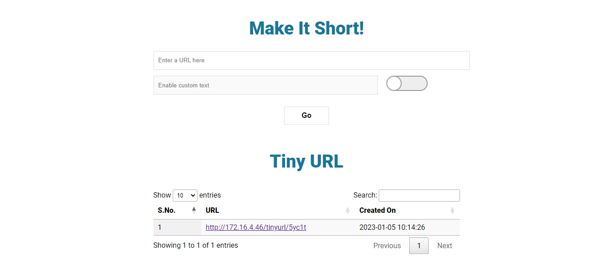

# Make It Short

> TinyURL is a URL shortening web service, which provides short aliases for redirection of long URLs.

### Screenshots

---

### How to install ?

1. Create a MySQL database

2. Connect to your database and execute the SQL statements contained in the file **database/urls.sql**

3. Edit the **config.php** file

4. Upload files into your server

5. That's it !